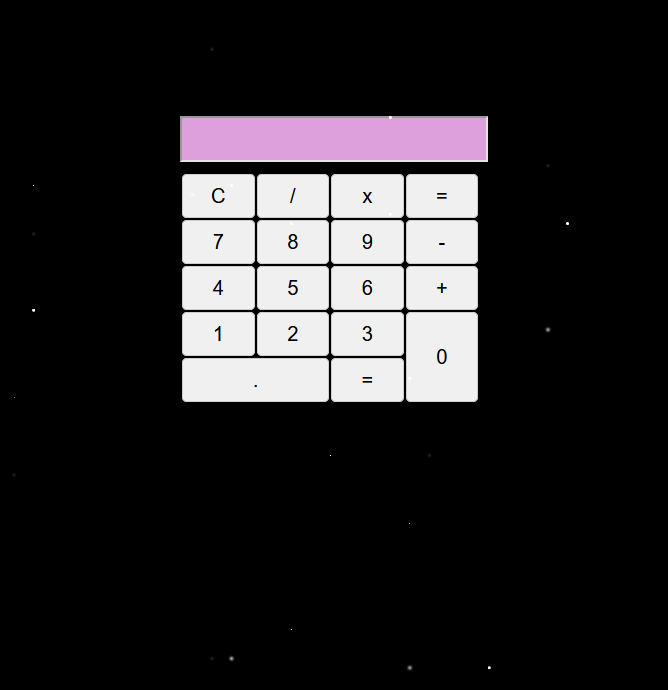

# Calculator App

A simple calculator app built using Javascript, HTML, and CSS. The app enables users to perform basic arithmetic calculations right in their web browser.

## Description

-Users can input numbers and perform calculations using basic arithmetic operations like addition, subtraction, multiplication, and division.

-Displays the result in a designated area on the interface.

-Users can clear the display, and start a new calculation using the clear button.

## Technologies Used
-HTML

-CSS

-Javascript

## How To Interact

-Clone this repository

-Open the HTML file in your browser

-Start calculating

# Enjoy using the Calculator App!
